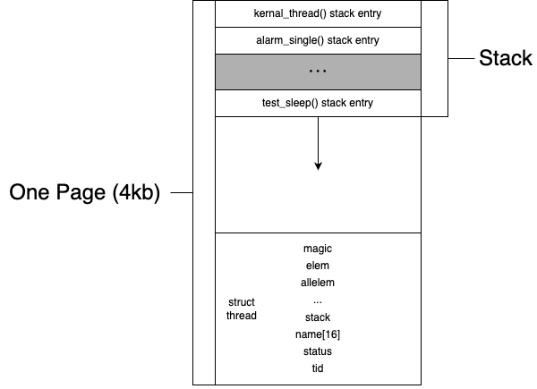

# Project 1: Threads

## Preliminaries

Team Number: 20

윤병준(20190766)

김치헌(20190807)

*We use GPT-4 to revise grammar errors in this report.*

## Table of Contents

- [Project 1: Threads](#project-1--threads)
    * [Preliminaries](#preliminaries)
- [Analysis of the current implementation](#analysis-of-the-current-implementation)
    * [Threads](#threads)
        + [Overview of Thread life cycle implementation in PintOS](#overview-of-thread-life-cycle-implementation-in-pintos)
        + [Thread Memory Layout](#thread-memory-layout)
        + [Thread State](#thread-state)
    * [Thread Switching](#thread-switching)
        + [Overview](#overview)
        + [`schedule()`](#-schedule---)
        + [`switch_threads()`](#-switch-threads---)
        + [Special Case: Starting a Thread for the First Time](#special-case--starting-a-thread-for-the-first-time)
    * [Synchronization](#synchronization)
        + [Disabling interrupts](#disabling-interrupts)
        + [Semaphore](#semaphore)
        + [Lock](#lock)
        + [Condition Variable](#condition-variable)
        + [Optimization barrier](#optimization-barrier)
- [Requirements](#requirements)
    * [Alarm Clock](#alarm-clock)
        + [Overview of Current Implementation](#overview-of-current-implementation)
        + [Data Structures](#data-structures)
        + [Algorithms](#algorithms)
        + [Implementation](#implementation)
        + [Rationale](#rationale)
    * [Priority Scheduling](#priority-scheduling)
        + [Overview of Current Implementation](#overview-of-current-implementation-1)
        + [Data Structures](#data-structures-1)
        + [Algorithms](#algorithms-1)
        + [Implementation](#implementation-1)
        + [Rationale](#rationale-1)
    * [Advanced Scheduler](#advanced-scheduler)
        + [Overview of Current Implementation](#overview-of-current-implementation-2)
        + [Data Structures](#data-structures-2)
        + [Algorithms](#algorithms-2)
        + [Implementation](#implementation-2)
        + [Rationale](#rationale-2)

# Analysis of the current implementation

## Threads

### Overview of Thread life cycle implementation in PintOS

The current implementation of threads in PintOS starts at `main()` in `src/threads/init.c`.

```c
int main(void) {
  /* initialization */
  thread_init();
  /* Init memory system */
  thread_start();
  /* shutdown */
  thread_exit();
}
```

`thread_init()`'s primary purpose is to create the first thread for PintOS. A key feature of `thread_init()` is to set
the MAGIC value to the running thread. Details of the MAGIC value are explained at the top of `thread.h`. The MAGIC
value is used to check whether the thread is valid or not. Since `struct thread` should not grow too large, its magic
member will work as a validity checker.

`thread_start` will create an `idle` thread (with `thread_create`) and use `sema_down` to prevent other processes from
joining. Once the `idle thread` is created, it will `sema_up` to release the last `sema_down` from `thread_create`.
Then, it blocks itself, allowing the `run_action` in `main()` to run another thread. The idle thread will wake up when
there are no available threads to run.

`thread_create` will create a new thread based on the given argument. The function receives a function name, priority,
and an argument (`aux`). This function will allocate memory for a page for `struct thread` and stack frames
for `kernel_thread` and switching. Initially, `init_thread` initializes a thread in the `THREAD_BLOCKED` state. Just
before returning, `thread_unblock()` is called, setting the thread state to `THREAD_READY`.

### Thread Memory Layout

Suppose `thread_create()` is called with argument `"alarm_single"`. Then, the memory layout of the thread will be as
follows:

<p align="center">
  
</p>

`struct thread` locate at the very bottom of the page, the stack frame for `kernel_thread` is located on the top of the
page, and stack frame of called functions grow downward. If stack frame grows too large, it will overlap with
the `struct
thread`. Resulting in a memory corruption, which can be identified by checking the MAGIC value.

### Thread State

<!-- 
digraph finite_state_machine {
    rankdir=TB;

    node [shape = rectangle];
    center [shape=none, width=0, height=0, label=""];  // Invisible center node

    // Triangle arrangement
    center -> THREAD_READY [style=invis];


    // Initialization state
    init [shape=point];   // This represents the small dot or circle
    init -> THREAD_READY;

    {rank=min; init THREAD_READY THREAD_RUNNING THREAD_DYING exit}
    
    init -> exit [style=invis]
    exit [shape=point];
    
    THREAD_READY -> THREAD_RUNNING [label="schedule()", minlen=4]
    THREAD_RUNNING -> THREAD_READY [label="thread_yield()"]
    THREAD_RUNNING -> THREAD_DYING [label="thread_exit()"]
    THREAD_RUNNING -> THREAD_BLOCKED [label="thread_block()"]
    THREAD_BLOCKED -> THREAD_READY [taillabel="thread_unblock()\n\n"]

    THREAD_DYING -> exit
}
-->
<p align="center">
  
</p>

The state diagram of the thread life cycle has one exception: the `THREAD_RUNNING` state can be initialized
by `thread_init()`, called by `main()` to set the first thread.

- `THREAD_READY`: The thread is ready to run but isn't running. Once the scheduler selects this thread, it will run
  next. Managed in `ready_list` in `src/threads/thread.c`.

- `THREAD_RUNNING`: The thread is currently running, and only one thread can be in this state.

- `THREAD_BLOCKED`: The thread is blocked, waiting for an event such as a lock release or a semaphore to be upped.

- `THREAD_DYING`: The thread will be destroyed soon.

This life cycle is defined in `src/threads/thread.c` as the enum `thread_status`. This enum is stored in the `status`
member of `struct thread`.

```c
/* States in a thread's life cycle. */
enum thread_status {
  THREAD_RUNNING,     /* Running thread. */
  THREAD_READY,       /* Not running but ready to run. */
  THREAD_BLOCKED,     /* Waiting for an event to trigger. */
  THREAD_DYING        /* About to be destroyed. */
};
```

A key aspect of the thread life cycle is determining the order in which threads run next or how the OS manages the
priority of threads in the `ready_list`. The current implementation of `ready_list` is as a FIFO list containing all
threads ready to run.

## Thread Switching

### Overview

<p align="center">
  
</p>

The above diagram shows the process of thread switching. The current thread is in the `THREAD_RUNNING` state. If a
thread
has used up its timeslice, `thread_tick()` (called by `timer_interrupt`) will call the
function `intr_yield_on_return()`. `intr_yield_on_return()` change `yield_on_return` flag to `true` and let 
`intr_handler` know. Then, `intr_handler` will call `thread_yield()` to switch to the next thread. `thread_yield()` will
call `schedule()` and `switch_threads()` to switch to the next thread during interrupt.

### `schedule()`

`schedule()` is responsible for deciding which thread runs next. This function is invoked
by: `thread_block()`, `thread_exit()`, and `thread_yield()`. Before calling `schedule()`, interrupts should be disabled
by using `intr_disable()`. If interrupts are not disabled, an interrupt handler might be called during thread
switching. `schedule()` chooses the next thread by invoking `next_thread_to_run()` and switches from the current to the
next thread.

`thread_schedule_tail()` completes the switching process. It sets the current thread to the `THREAD_RUNNING` state and
starts a new time slice. If the thread being switched from is in the `THREAD_DYING` state, we free the allocated memory,
which includes `struct thread` and the `stack frame`. We free the memory after switching because we need the information
in this memory for `switch_threads()`. Freeing the memory before switching would prevent access to this necessary
information.

### `switch_threads()`

Within `switchs.S`, we find the assembly code responsible for thread switching. The `CUR` thread is the one currently
executing, while the `NEXT` thread is the one we'll be switching to. The purpose of `switch_threads()` is to save the
state of `CUR` and restore the state of `NEXT`. Let's break down the process:

1. **Save Registers**

```asm
pushl %ebx
pushl %ebp
pushl %esi
pushl %edi
```

The registers `ebx`, `ebp`, `esi`, and `edi` are callee-saved registers. It's imperative that a called function
preserves their values.

2. **Save Current Stack Pointer**

```asm
mov thread_stack_ofs, %edx # uint32_t thread_stack_ofs = offsetof(struct thread, stack); from thread.c
movl SWITCH_CUR(%esp), %eax
movl %esp, (%eax,%edx,1)
```

The `thread_stack_ofs` represents the offset of the `stack` member in the `struct thread`. `SWITCH_CUR` is the offset
from the `struct switch_threads_frame` to the `cur` member. The operation `movl SWITCH_CUR(%esp), %eax` yields a pointer
to the current thread's `struct thread`. The last line here saves the current stack pointer to the `stack` member of the
current thread.

3. **Restore Next Stack Pointer**

```asm
movl SWITCH_NEXT(%esp), %eax
movl (%eax,%edx,1), %esp
```

Similarly, `movl SWITCH_NEXT(%esp), %eax` results in a pointer to the next thread's `struct thread`.
Adding `thread_stack_ofs`, now stored in `%edx`, yields a pointer to the `stack` member of the next thread. The final
line restores the stack pointer of the next thread.

4. **Restore Registers**

```asm
popl %edi
popl %esi
popl %ebp
popl %ebx
```

5. **Return to Caller**

```asm
ret
```

### Special Case: Starting a Thread for the First Time

The initialization of a thread poses a unique challenge. Specifically, the stack pointer for the thread hasn't been set
yet. As noted, `switch_threads()` requires information about the previous stack to switch to the next thread correctly.
However, an initial thread lacks this prior stack. Thus, it becomes necessary to initialize certain stack frames for the
first thread. This initialization is performed in `thread_start()`, found in `src/threads/thread.c`.

```c
tid_t
thread_create(const char *name, int priority,
              thread_func *function, void *aux)
{
  struct thread *t;
  struct kernel_thread_frame *kf;
  struct switch_entry_frame *ef;
  struct switch_threads_frame *sf;
```

At the top is the `switch_threads_frame`. Its `eip` points to `switch_entry()`, as defined in `switch.S`. This means
that the next function to be called will be `switch_entry()`.

The subsequent frame is `switch_entry_frame`, whose task is to invoke `thread_schedule_tail()` for the first time. A
more detailed description follows:

```asm
# Implementation of switch_entry() in `switch.S`
addl $8, %esp # discard switch_threads() arguments: cur and next
pushl %eax    # push SWITCH_CUR(%esp) to the stack, which will be the argument for thread_schedule_tail()
              # SWITCH_CUR(%esp) points to the current thread's struct thread
call thread_schedule_tail 
addl $4, %esp # clean up stack
```

The `switch_entry` function aids `switch_threads()`. Its main job is to discard the arguments to `switch_threads()` and
then call `thread_schedule_tail()`.

Lastly, we have `kernel_thread_frame`, which calls `function` with `aux` as its argument. Within `kernel_thread()`,
interrupts are enabled, `function` is called with the argument `aux`, and finally, `thread_exit()` is invoked.

In summary, the roles of `kernel_thread_frame`, `switch_entry_frame`, and `switch_threads_frame` are to establish the
correct execution environment for the first thread. This setup ensures that the initial thread can seamlessly
invoke `thread_schedule_tail()` and switch to the next thread.

## Synchronization

### Disabling interrupts
When dealing with synchronization problems, ensuring that preemption does not occur while executing the atomic function is crucial.
So, it is necessary to prevent the preemption from occurring.
In pintos, the preemption occurs when the `thread_ticks` gets greater than `TIME_SLICE`.
The `thread_ticks` is increased by the `thread_tick()`, called by the external interrupt handler `timer_interrupt()`.
Thus, turning off the interrupt can be the solution.
The interrupt can be controlled manually via the functions defined in `src/interrupt.c`.
Specifically, disabling interrupts can be done by `intr_disable()` and rollback interrupts by `intr_set_level()`.

### Semaphore
A semaphore is a synchronization primitive invented to control access to a common resource shared by multiple threads.
The semaphore S is a variable that holds an integer value, and this value can be accessed and edited by only two operators, P and V.
The integer value held by the semaphore is the number of currently available units.
A thread calls P before accessing the critical section(a shared resource that two or more threads should not access).
If the semaphore value is over 1, decrement the value and enter the critical section.
If not, the thread waits until the value is positive, then enters the critical section, decrementing the value.
A thread calls V after completing the operation in the critical section.
V increments the semaphore value.

Pintos implemented a semaphore as follows.
```c++
struct semaphore
  {
    unsigned value;         /* Current value. */
    struct list waiters;    /* List of waiting threads */
  };
```
A `semaphore` is initiated by `sema_init()`. For P and V, `sema_up()` and `sema_down()` is implemented.

- `sema_init()`: Set an initial value for the variable `value` and initiate a list, `waiters`.
- `sema_down()`: P. If the `value` is 0, the caller thread is pushed into the `waiters` by `list_push_back()` and blocked by `thread_block()`. When the `value` becomes positive, the caller thread decrements the `value` and returns to access the critical section.
- `sema_up()`: V. If `waiters` is not empty (i.e., there are threads that want to access the critical section), the front thread is popped by `list_pop_front()`. Then, the popped thread takes access to the critical section. Regardless of `waiters`, `sema_up()` increments the `value`.

According to the semaphore definition, it seems normal to initialize the semaphore's value to a positive number depending on how many resources are available.
However, we can find that pintos initialize the value with zero and then call `sema_down()`.
In this case, the caller (i.e., the thread that initialized the semaphore and called `sema_down()`) immediately pushed into `waiters` and then blocked.
As the caller whose state was running is blocked, another thread in the ready list is selected and becomes the following running thread.
The selected running thread does its job and then calls `sema_up()` to make the previous running thread become the current running thread again.
A typical example is the initializing step of the `idle` thread. The `main` thread initializes the semaphore `idle_started` with `value` 0 and calls `sema_down` to pass the control flow to the `idle` thread.
After the function `idle()` is started, the `idle` thread calls `sema_up()` to give the control flow back to the `main` thread.

There are other functions for `semaphore` in pintos, `sema_try_down()` and `sema_self_test()`.

`sema_try_down()` is similar to `sema_down()` as it is a kind of P function. However, it works only when the `value` is positive.
In other words, if the `value` is 0, it returns `false`, and the caller neither enters the `waiters` nor becomes blocked.
If the `value` is positive, it decreases the `value` by one and returns `true`.

`sema_self_test()` is a function for self-testing.

### Lock
A Lock is a synchronization primitive like a semaphore. It is used for controlling access to a shared resource like semaphore.
The semaphore's P(or "down") is "acquire" in the lock, and the V (or "up") of the semaphore is "release" in the lock.

There are two main differences between a lock and a semaphore.

- One is the range of the value can have.
A Semaphore can have various values larger than 1, but a lock's value can only be 0 or 1.
In other words, a lock is a binary semaphore.

- Another is the presence of the lock holder.
In semaphore, there is no owner or holder. It means a thread can "up" the semaphore without being the thread "downed" it.
In contrast, a lock can only be "released" by the thread that "acquired" it.

Pintos implemented a lock as follows.
```c++
struct lock
  {
    struct thread *holder;          /* Thread holding lock */
    struct semaphore semaphore;     /* Binary semaphore controlling access */
  };
```
As a lock performs like a binary semaphore, it has a `semaphore` as a member variable and a `holder` for the thread holding the lock.
A function `lock_init()` initializes a lock. There are four functions to implement the lock features.

- `lock_init()`: Initialize `holder` and `semaphore`. Initially, there is no holder, so initialize `holder` with `NULL`.
As the lock is the binary semaphore, `semaphore` is initialized with the value 1.
- `lock_acquire()`: Checks whether the `holder` is the caller(it must not), and then invoke `sema_down()`. Then, set the `holder` to the current thread.
- `lock_release()`: Checks whether the `holder` is the caller(it must be), and then set the `holder` NULL. Then invoke `sema_up()`.
- `lock_try_acquire()`: Lock version of `sema_try_down()`. Acquire the lock only when the `holder` is NULL.
- `lock_held_by_current_thread()`: `lock_acquire()` and `lock_release()` use this function to check the `holder`.
It returns `true` if the `holder` is the current thread. Otherwise, it returns `false`.

### Condition Variable
A condition variable is a synchronization primitive designed to solve a synchronization problem.
A semaphore and a lock can handle the concurrency problem by limiting the number of threads to access the critical area.
However, they do not focus on controlling the order in the interdependent threads.
The condition variable defines how the dependent thread gives the control flow to the responsible thread and takes it back.

If a thread(Thread A) wants to access the shared resource after another thread(Thread B) works on that shared value, it uses a condition variable.
In this case, the "condition" is "Is Thread B finished its work?". Thread A waits for the condition to become true, and Thread B signals to Thread A if the condition is satisfied.
Here is a brief explanation of how the condition variable works using a lock and a semaphore.

- First, Thread A needs to lock the common resource and acquire to prevent other threads from accessing.
- Then, it prepares a semaphore with an initial value of 0 to block itself until the common resource is ready.
- After preparing the semaphore, it releases the lock and blocks itself using the prepared semaphore so that Thread B can access it.
- The Thread B acquires the lock and does the work needed on the common resource.
- When Thread B finishes the job, it sends a signal to the blocked thread, Thread A, which is the V operation of the semaphore.
- Finally, it can release the lock for Thread A.

Pintos implemented a condition as follows.
```c++
struct condition
  {
    struct list waiters;    /* List of waiting threads */
  };
```
The list `waiters` holds the struct `semaphore_elem` elements.
`semaphore_elem` is defined like below.
```c++
struct semaphore_elem
  {
    struct list_elem elem;          /* List element */
    struct semaphore semaphore;     /* This semaphore. */
  };
```
`condition` is initialized by `cond_init()` and performs its functionality with three functions, `cond_wait()`, `cond_signal()` and `cond_broadcast()`.
- `cond_init()`: Initialize the list `waiters`.
- `cond_wait()`: Receives a `lock` as an argument and has a local variable `semaphore_elem` `waiter`.

This `lock` is the lock already acquired by the caller.

After calling `cond_wait()`, the `waiter` semaphore initialized with the `value` 0 and `list_push_back()` into `waiters`.
Then the `lock` released, and the `waiter` semaphore downed to make the thread wait for the "signal".
As the `lock` is released, it can be acquired by other threads. The thread which acquires the `lock` will send the signal to the waiting thread.
The "signal" will make the semaphore up, and after receiving the signal, the thread re-acquires the lock.
- `cond_signal()`: Called by the current thread, which acquires the lock released in `cond_wait()`.
It makes the first waiting semaphore up (i.e., make the waiting thread ready).
After calling `cond_signal()`, the caller can release the lock.
- `cond_broadcast()`: If there is more than one `waiter` in the `waiters`, the caller can send signals to every `waiter` in `waiters` using this function.

### Optimization barrier
An optimization barrier is a barrier to the compiler not optimizing or reordering across it.
Without the barrier, the compiler can optimize and reorder the instructions, resulting in a buggy program because the order of the instructions plays an important role in the synchronization problem.

# Requirements

## Alarm Clock

We should reimplement the `timer_sleep()` function defined in `device/timer.c`.

### Overview of Current Implementation

```c++
/* Sleeps for approximately TICKS timer ticks.  Interrupts must
   be turned on. */
void
timer_sleep (int64_t ticks)
{
int64_t start = timer_ticks ();

ASSERT (intr_get_level () == INTR_ON);
while (timer_elapsed (start) < ticks)
thread_yield ();
}
```

Current implementation of the `time_sleep()` is "busy wait", in this case, we can call it "busy sleeping".
In the last two lines of the code, we can see the thread still sleeping is being pushed by calling the `thread_yield()`.
If this thread becomes the running thread before the `ticks` ticks elapsed, it'll just call the `thread_yield()` and go
back to the ready list, because it will be still busy sleeping.
The sleeping threads will do nothing but call `thread_yield()`, this implementation has a room for improvement.

### Data Structures

To effectively manage the sleeping thread, we defined a new list and its element structure.

```c++
static struct list sleep_list;

struct sleep_list_elem {
    struct list_elem elem;          /* List element */
    int64_t end_tick;               /* Tick to wake up */
    struct semaphore semaphore;     /* Semaphore to block a sleeping thread */
};
```

### Algorithms

Sleeping algorithms

- A structure `sleep_list_elem` variable(says `sleep_elem`) is generated by the thread that called the
  new `timer_sleep()`.
- The thread insert `sleep_elem` into the `sleep_list` in ascending order of `end_tick`.
- Then the thread call the `sema_down()` to sleep.
- The `semaphore` takes care of the sleeping thread until the `sema_up()` called.

Awakening algorithms

- Every `thread_tick()` call will check whether there is a `sleep_list_elem` reach the `end_tick`.
- As every `sleep_list_elem` is sorted in ascending order of `end_tick`, we can check the front element.
- If the `end_tick` of the front element is bigger than the current tick, we end search.
- Otherwise,
    - We `list_pop_front()` and `sema_up()` the `semaphore` of the popped `sleep_list_elem`.
    - Iterate until finding the `sleep_list_elem` whose `end_tick` is bigger than the current tick.


### Implementation

Initializing the `sleep_list` will be added to the `thread_init()`.

We need a new function in `src/thread.c` to implement the sleeping algorithms above.
The new function `thread_sleep()` will look like the following code and be called by the `timer_sleep()`.

```c++
void thread_sleep(int64_t end_tick) {
    /* Define `sleep_list_elem` variable and initialize it */
    ...
    
    /* Insert `sleep_list_elem` into the `sleep_list` */
    /* We need to define `list_less_function`, `less()`, to use the `list_insert_ordered()` */
    ...
    
    /* Semaphore down. (i.e., Start sleeping) */
    ...
}
```

Then the new `timer_sleep()` is defined as below.

```c++
void timer_sleep(int64_t ticks) {
    int64_t start = timer_ticks;
    
    ASSERT (intr_get_level () == INTR_ON);
    thread_sleep(start+ticks);
}
```

To implement the awakening algorithm, we need to modify `thread_tick()` or define a new function called
by `timer_interrupt()`.
In any case, we need to have the code looks like the following code. In this case we define a new function
named `thread_wakeup()`.

```c++
void thread_wakeup(int64_t current_tick) {
    /* Define a placeholder for iterating */
    ...
    /* While loop until the `sleep_list` empty */
    while(!list_empty(sleep_list)) {
        /* Get the front element */
        ...
        /* Break the while loop if the element's `end_tick` is greater than `current_tick` */
        if ( ... )
            break;
        /* Else, pop front from the `sleep_list` and call sema_up for its `semaphore` */
        ...
    }
}
```

Then the `thread_wakeup()` will be added in `timer_interrupt()`.

```c++
static void timer_interrupt(struct intr_frame *args UNUSED) {
    thread_wakeup(++ticks);
    thread_tick();
}
```

### Rationale

This implementation has some advantages.

The first one is that we don't have to change the member of the thread structure.
It is important to keep the thread structure simple.
Because the bigger the structure becomes, the lesser the memory space the thread can have.
And not adding a member about sleeping to the thread structure fits logically since not every thread are going to sleep.

The second one is that we reduced the overhead of finding the threads to wake up.
There are two methodology we can choose for the sleep_list.
The first is to sort when inserting then find efficiently. The second is to push back first then search for it later.
Both have pros and cons in some situations. The first approach has more overhead in inserting, while the second one has
more overhead in finding.
We chose the first approach because in this situation, finding has more frequent appearance than inserting. (we have to
find the thread to wake up every single tick!)

## Priority Scheduling

### Overview of Current Implementation

### Data Structures

### Algorithms

### Implementation

### Rationale

## Advanced Scheduler

### Overview of Current Implementation

### Data Structures

### Algorithms

### Implementation

### Rationale