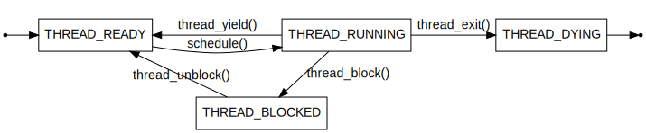

# Project 1: Threads

## Preliminaries

Team Number: 20

윤병준(20190766)

김치헌(20190807)

## Table of Contents

- [Project 1: Threads](#project-1--threads)
    * [Preliminaries](#preliminaries)
- [Analysis of the current implementation](#analysis-of-the-current-implementation)
    * [Threads](#threads)
        + [Overview of Thread life cycle implementation in PintOS](#overview-of-thread-life-cycle-implementation-in-pintos)
        + [Thread State](#thread-state)
            - [Ready List](#ready-list)
    * [Scheduling](#scheduling)
    * [Syncronization Primitives](#syncronization-primitives)
        + [Lock](#lock)
        + [Semaphore](#semaphore)
        + [Condition Variable](#condition-variable)
        + [Optimization barrier](#optimization-barrier)
- [Requirements](#requirements)
    * [Alarm Clock](#alarm-clock)
        + [Overall structure](#overall-structure)
        + [Data Structures](#data-structures)
        + [Algorithms](#algorithms)
        + [Implementation](#implementation)
        + [Rationale](#rationale)
    * [Priority Scheduling](#priority-scheduling)
        + [Overall structure](#overall-structure-1)
        + [Data Structures](#data-structures-1)
        + [Algorithms](#algorithms-1)
        + [Implementation](#implementation-1)
        + [Rationale](#rationale-1)
    * [Advanced Scheduler](#advanced-scheduler)
        + [Overall structure](#overall-structure-2)
        + [Data Structures](#data-structures-2)
        + [Algorithms](#algorithms-2)
        + [Implementation](#implementation-2)
        + [Rationale](#rationale-2)

# Analysis of the current implementation

## Threads

### Overview of Thread life cycle implementation in PintOS

A current implementation of threads in pintos starts at `main()` in `src/threads/init.c`.

```c
int main(void){
  /* initizliation */
  thread_init();
  /* Init memory system */
  thread_start();
  /* shutdown */
  thread_ext();
}
```

`thread_init()`'s main purpose is to create the first thread for the pintos.
One of the key feature of `thread_init()` is to set MAGIC value to running thread.
Detail of MAGIC value is explained at the top of `thread.h`.
MAGIC value is used to check whether the thread is valid or not.
Since `struct thread` should not grow too large, `struct thread`'s magic member will
work as validity checker whether the thread is valid or not.

`thread_start` will `thread_create` `idle` thread and `sema_down` to prevent other process to join.
As soon as `idle thread` created, it will `sema_up` to release the last `sema_down` from `thread_create`.
Then, block idle itself. This will allow `run_action` in `main()` to run other thread.
This idle thread will wake up when there is no available thread to run.

`thread_create` will create a new thread according to givven argument. The function get
a function name, priority and argument(`aux`). The function will allocate memory for
page for `sturct thread` and stack frame for `kernal_thread`, and `switching`.
Initially, `init_thread` init thread in `THREAD_BLOCKED` state. Just before returning,
`thread_unblock()` is called and set the thread state to `THREAD_READY`.

### Thread State

<!-- 
digraph finite_state_machine {
    rankdir=TB;

    node [shape = rectangle];
    center [shape=none, width=0, height=0, label=""];  // Invisible center node

    // Triangle arrangement
    center -> THREAD_READY [style=invis];


    // Initialization state
    init [shape=point];   // This represents the small dot or circle
    init -> THREAD_READY;

    {rank=min; init THREAD_READY THREAD_RUNNING THREAD_DYING exit}
    
    init -> exit [style=invis]
    exit [shape=point];
    
    THREAD_READY -> THREAD_RUNNING [label="schedule()", minlen=4]
    THREAD_RUNNING -> THREAD_READY [label="thread_yield()"]
    THREAD_RUNNING -> THREAD_DYING [label="thread_exit()"]
    THREAD_RUNNING -> THREAD_BLOCKED [label="thread_block()"]
    THREAD_BLOCKED -> THREAD_READY [taillabel="thread_unblock()\n\n"]

    THREAD_DYING -> exit
}
-->


This is state diagram of thread life cycle. One exception is `THREAD_RUNNING` state,
which can be initialized by `thread_init()` called by `main()` to set the first thread.

`THREAD_READY`: thread is ready to run, but not running. Once a scheduler choose this thread,
it will be the next thread to run. Managed in `ready_list` in `src/threads/thread.c`.

`THREAD_RUNNING`: thread is running, only one thread can be in this state.

`THREAD_BLOCKED`: thread is blocked, waiting for SOMETHING (lock to be released, semaphore to be up, etc).

`THREAD_DYING`: thread will be destroyed soon.

Above life cycle is implemented in `src/threads/thread.c` as enum `thread_status`.
This enum is stored in `status` member in `struct thread`.

```c
/* States in a thread's life cycle. */
enum thread_status
{
THREAD_RUNNING,     /* Running thread. */
THREAD_READY,       /* Not running but ready to run. */
THREAD_BLOCKED,     /* Waiting for an event to trigger. */
THREAD_DYING        /* About to be destroyed. */
};
```

The key algorithm for thread life cycle is how to choose "order of which thread to run next". In other words,
how can OS manage a priority of thread in `ready_list`. Current implementation of `ready_list` is implemented is FIFO
list that contains all the thread that is ready to run.

## Thread Switching

### `schedule()`

`schedule()` is responsible for choosing which thread to run next. This function is called by: `thread_block(),
thread_exit(), thread_yield()`. Before calling `schedule()`, interrupt should be disabled by calling `intr_disable()`.
If interrupt is not disabled, there is a chance that interrupt handler will be called while switching
thread. `schedule()`
will choose the next thread by calling `next_thread_to_run()` and switch from `cur` to `next` thread.

`thread_schedule_tail()` will do the rest of the work. It will mark `cur` thread to `THREAD_RUNNING` state and start
new time slice. If the thread that we just switched is from `THREAD_DYING`, we will free palloced memory
including `struct thread` and `stack frame`. The reason for freeing memory after switching is we need information in
this memory for `switch_threads()`. If we free memory before switching, we will not be able to get information

### `switch_threads()`

`switchs.S` contains assembly code for switching thread. `CUR` is the current running thread and `NEXT` is the
thread we are switching to. `switch_threads()` will save the state of `CUR` and restore the state of `NEXT`. The code
can be break down into a few parts.

1. Save registers

```asm
pushl %ebx
pushl %ebp
pushl %esi
pushl %edi
```

Registers `ebx`, `ebp`, `esi`, `edi` are callee saved registers. Thus, a called functio must preserve their value.

2. Save current stack pointer

```asm
mov thread_stack_ofs, %edx # uint32_t thread_stack_ofs = offsetof (struct thread, stack); in thread.c
movl SWITCH_CUR(%esp), %eax
movl %esp, (%eax,%edx,1)
```

`thread_stack_ofs` is the offset of the `stack` member in the `struct thread`. `SWITCH_CUR` is the offset from
the `struct switch_threads_frame` to the `cur` member. `cur` is the current running thread.
`movl SWITCH_CUR(%esp), %eax` will result a pointer to the current running thread's `struct thread`. The last
statement will save the current stack pointer to the `stack` member of the current running thread (%eax + %edx =
%eax + thread_stack_ofs = %eax + offsetof (struct thread, stack) = &cur->stack).

3. Restore next stack pointer

```asm
movl SWITCH_NEXT(%esp), %eax
movl (%eax,%edx,1), %esp
```

Likely, `movl SWITCH_NEXT(%esp), %eax` will result a pointer to the next thread's `struct thread`.
Adding `thread_stack_ofs` stored in `%edx` will result a pointer to the `stack` member of the next thread. The last
statement will restore the stack pointer to the next thread's stack pointer (%eax + %edx = %eax + thread_stack_ofs =
%eax + offsetof (struct thread, stack) = &next->stack).

4. Restore registers

```asm
popl %edi
popl %esi
popl %ebp
popl %ebx
```

5. Return

```asm
ret
```

### Special case: Running a thread for the first time

Running a thread for the first time is a special case. The stack pointer of the thread is not initialized yet. Mentioned
above, `switch_threads()` requires previos stack's information to properly switch to the next thread. However, the
first thread does not have a previous stack. Thus, we need to initialize some fame stack frames in the first thread's
stack. This is done in `thread_start()` in `src/threads/thread.c`.

```c
tid_t
thread_create (const char *name, int priority,
               thread_func *function, void *aux) 
{
  struct thread *t;
  struct kernel_thread_frame *kf;
  struct switch_entry_frame *ef;
  struct switch_threads_frame *sf;
```

The topmost is `switch_threads_frame`. Its eip is set to point to `switch_entry()` defined in `switch.S`. This make
the next function to call is `switch_entry()`

The second is `switch_entry_frame`. Its role is to call `thread_schedule_tail()` for the first time. Detailed
explanation
follows.

```asm
# Implementation of switch_entry() in `switch.S`
addl $8, %esp # discard switch_threads() arguments: cur and next
pushl %eax # push SWITCH_CUR(%esp) to the stack, it will be the argument of thread_schedule_tail(), 
           # SWITCH_CUR(%esp) is the pointer to CUR thread's struct thread
call thread_schedule_tail 
addl $4, %esp # clean up stack
```

`switch_entry` is a helper function for `switch_threads()`. It will discard argument to `switch_threads()` and
call `thread_schedule_tail()`.

The third is `kernel_thread_frame`. Its role is to call `function` with `aux` as argument. `kernel_thread()` will
enable interrupt, call `function` with argument `aux`, and `thread_exit()`.

To wrap up, the role of `kernel_thread_frame`, `switch_entry_frame`, and `switch_threads_frame` is to setup proper
execution environment for the first thread. The first thread will call `thread_schedule_tail()` and switch to the next
thread flawlessly.

## Syncronization Primitives

### Lock

### Semaphore

### Condition Variable

### Optimization barrier

# Requirements

## Alarm Clock

### Overall structure

### Data Structures

### Algorithms

### Implementation

### Rationale

## Priority Scheduling

### Overall structure

### Data Structures

### Algorithms

### Implementation

### Rationale

## Advanced Scheduler

### Overall structure

### Data Structures

### Algorithms

### Implementation

### Rationale