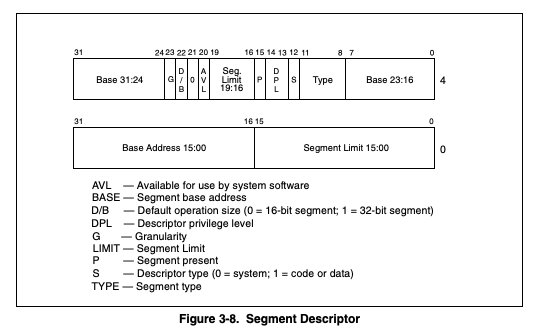

# Project 2: User Programs

## Preliminaries

Team Number: 20

윤병준(20190766)

김치헌(20190806)

## Table of Contents

# Analysis of current implementation

## Process execution procedure

핀토스 부팅 시에 불리는 엔트리 포인트 `threads/init.c`의 `main()`을 보면 User Program을 위해 초기화를 진행하는
함수들을 볼 수 있다. `tss_init()`, `gdt_init()`은 세그멘테이션 초기화 과정이며, `exception_init()`, `syscall_init()`은
User mode 프로세스에서 발생할 수 있는 내부적인 인터럽트를 초기화하는 과정이다.
세그멘테이션은 x86 아키텍쳐에서 메모리를 조각내어(segment) 관리하는 방법을 말한다. 각 세그먼트에 대한 정보는
GDT(Global Descriptor Table)에 저장된다. GDT에는 kernel code, kernel data, user code, user data, tss 세그먼트가
디스크립터의 형식으로 저장된다. 여기서 tss는 Task State Segment로, task switching이 발생할 때 사용한다.
유저 모드에서 인터럽트가 발생했을 때, 현재 tss에 저장된 ring0 (kernel mode)의 ss, esp인 `ss0`, `esp0`를 불러와 인터럽트를 처리한다.

```c
void tss_init(void) {
  // alloc tss 
  tss->ss0 = SEL_KDSEG;
  tss->bitmap = 0xdfff;
  tss_update();
}

void tss_update(void) {
  ASSERT(tss != NULL);
  tss->esp0 = (uint8_t *) thread_current() + PGSIZE;
}
```

GDT의 세그먼트 디스크립터에는 base, limit, class, type, dpl 등의 정보가 저장되어있다.



위 그림에서 GDT에 저장되는 세그먼트 디스크립터의 구조를 알 수 있다 (
ref. [IA-32 Intel Architecture Software Developer's Manual Volume 3A](https://flint.cs.yale.edu/cs422/doc/24547212.pdf)).
이 구조중에서 중요한 부분은 DPL 인데, DPL 은 Descriptor Privilege Level 의 약자로서 해당 세그먼트의 권한 레벨을 나타낸다.
0 가 kernal previleged level 이고, 3 이 user previleged level 이다. 이 DPL 값에 따라서,
현재 실행중인 프로세스가 해당 세그먼트에 접근할 수 있는지 관리하게 된다.

이렇게 프로그램이 실행될 환경을 셋업한 이후에 `run_actions(argv)` 를 호출해 프로그램을 시작하게 된다.
`run_actions(argv)` 의 커맨드를 확인해 보면, `action` 에 `run` 들어오게 되면,
`run_task()` -> `process_execute(task)` 을 순차적으로 불러 프로세스를 실행하게 된다.

`process_execute(task)`는 `task` 의 이름으로 스레드를 생성하고, `start_process` 를 하게 된다.

```c
tid_t process_execute(const char *file_name) {
  // ...
  /* Create a new thread to execute FILE_NAME. */
  tid = thread_create(file_name, PRI_DEFAULT, start_process, fn_copy);
  if (tid == TID_ERROR)
    palloc_free_page(fn_copy);
  return tid;
}
```

`start_process()`는 인터럽트 프레임을 설정하고, 프로그램을 메모리에 로드하기 위해 `load()` 를 호출한다.
이때 인터럽트 프레임의 `eip`와 `esp`는 `load()`의 인자로 전달하여 실행 프로그램의 메타데이터를 이용하여 설정되도록한다.
`load()`는 다음과 같은 작업을 수행한다. 가상 주소와 실제 주소를 연결짓는데 필요한 Page Directory를 할당받고,
CR3(PDBR) 레지스터에 할당받은 Page Directory의 주소를 저장하고 tss_update()를 통해
tss의 esp0를 현재 실행중인 스레드 스택의 top으로 설정한다. 이는 이후 이 실행 프로그램 실행 중에
ring0에 접근해야하는 인터럽트가 발생하면 현재 실행중인 스레드의 스택을 사용하기 위함이다. 이후 `load()`는
실행 프로그램을 열어 실행 헤더를 읽어 검증한 후, 프로그램의 내용을 분할하여 검증하고 새로 할당하는 메모리에 저장한다.
분할되어 저장된 프로그램의 내용들을 Page Directory에 등록하여 프로그램 각 부분의 가상 주소를 통해 실제 저장된 메모리에 접근할 수 있도록 한다.
setup_stack()은 스택을 위한 메모리를 할당하고 Page Directory에 등록한다.
이후, 해당 메모리에 접근할 수 있는 가상 주소(PHYS_BASE)를 인자로 받은 인터럽트 프레임의 esp에 저장한다.
인자로 받은 인터럽트 프레임의 eip에는 실행 파일 메타데이터에서 읽어온 엔트리 포인트를 저장한다.
`load()`가 성공적으로 완료되면 `intr_exit()` 을 이용해 마치 인터럽트에서 복귀하는 것처럼 프로그램을 실행한다.

```c
bool load(const char *file_name, void (**eip)(void), void **esp) {
   PHYS_BASE +----------------------------------+
             |            user stack            |
             |                 |                |
             |                 |                |
             |                 V                |
             |          grows downward          |
             |                                  |
             |                                  |
             |                                  |
             |                                  |
             |           grows upward           |
             |                 ^                |
             |                 |                |
             |                 |                |
             +----------------------------------+
             | uninitialized data segment (BSS) |
             +----------------------------------+
             |     initialized data segment     |
             +----------------------------------+
             |           code segment           |
  0x08048000 +----------------------------------+
             |                                  |
             |                                  |
             |                                  |
             |                                  |
             |                                  |
           0 +----------------------------------+

   */
  if (!setup_stack(esp))
    goto done;

  /* Start address to Elf32_Ehdr's entry point */
  *eip = (void (*)(void)) ehdr.e_entry;
  
  // return true if all success
}
```

인터럽트에서 복귀하는 것 처럼 프로그램을 실행한다는 의미는 OS 가 `start_process`를 인터럽트 프레임을
초기화 했고, 실행파일을 로드를 완료한 상태에서, `esp`, `eip` 가 적절하게 설정되었다면, 아래의
`intr_exit`을 통해 로드한 해당 프로그램으로 진입할 수 있다는 의미다.

```asm
.globl intr_exit
.func intr_exit
intr_exit:
        /* Restore caller's registers. */
	popal
	popl %gs
	popl %fs
	popl %es
	popl %ds

        /* Discard `struct intr_frame' vec_no, error_code,
           frame_pointer members.
            
            esp is set by setup_stack  (*esp = PHYS_BASE;)
        */
           
	addl $12, %esp

        /* Return to caller. (eip set to (void (*)(void)) ehdr.e_entry;) */
	iret
.endfunc
```

## System call procedure

### Interrupt

인터럽트는 프로세스가 실행되는 중에 발생하여 프로세스 외부적으로 처리해야하는 일을 통칭하는 말이다.
Timer나 I/O device에 의해서 발생하는 인터럽트는 외부(external) 인터럽트라고 한다.
내부(internal) 인터럽트에는 익셉션과 시스템 콜로 두 가지 종류가 있다.
익셉션은 프로세스가 실행되는 도중 발생하는 예기치 못하거나(unexpected), 악의적인(malicious) 동작을 말한다.
시스템 콜은 프로세스가 보다 상위의 권한이 필요할 때 커널에게 실행을 요청하기 위한 작업이다.

프로세스가 실행되는 중에 인터럽트가 발생하면 커널 컨텍스트로 변경하여 이를 처리해야한다.
다양한 종류의 인터럽트가 있기 때문에 서로 구별하기 위해 각각의 인터럽트에 대해 번호를 부여하고, 각 번호에 따라 다른 처리를 하도록 해야한다.
이를 위해 IDT(Interrupt Descriptor Table)를 사용한다. IDT에는 인터럽트 번호를 인덱스로 하여 gate가 저장되어 있다.
IDT에 등록된 gate에는 크게 Descriptor Privilege Level, Segment Selector, 그리고 해당 인터럽트가 불렸을 때 호출될 procedure의 entry point에 대한
offset이 저장된다.

핀토스의 인터럽트는 `init.c`의 `main()`에서 `intr_init()`을 통해 초기화된다.
`intr_init()`은 `idt`에 미리 `intr_stubs[i]`를 procedure로 하는 gate를 저장하는데, `intr_stubs`는 `intr-stub.S`에 정의되어있다.
이후 `lidt` 명령어를 통해 `idtr` 레지스터에 정의한 `idt`의 위치를 저장한다. 추가적으로 익셉션에 대해서는 번호에 맞는 `intr_names`에 그 이름을 저장한다.

인터럽트가 발생하면 `idt`에서 인터럽트 번호로 해당하는 gate를 찾아 `intr_stub()` -> `intr_entry()` -> `intr_handler()` 순서로 호출된다.
최종적으로 `intr_handler()`에서 `intr_handlers`에서 인터럽트 번호로 `handler`를 찾아와서 호출하여 인터럽트를 처리한다.
인터럽트가 발생했을 때의 자세한 과정은 이후 설명하겠지만, 초기화 과정에 주요한 것은 `intr_handlers`를 설정하지 않기 때문에 다른 초기화 과정을 통해 초기화 해야한다는 점이다.

익셉션은 `exeception_init()`, 시스템 콜은 `syscall_init()`에서 이 과정을 수행하며, 다른 필요한 외부 디바이스들 역시 각각의 init 함수를 이용한다.
각각의 init 함수에서는 인터럽트를 등록하기 위해서 `interrupt.c`에서 제공하는 `intr_register_int()`, `intr_register_ext()`를 사용한다.

`intr_register_int()`와 `intr_register_ext()`에서는 dpl, level, handler 등을 맞춰서 `register_handler()`를
호출하여 `idt`, `intr_handlers`,
`intr_names`에 저장되도록 한다.

### Entering Interrupt

[//]: # (@formatter:off)
```c
/* Interrupt stack frame. */
struct intr_frame {
  /* Pushed by intr_entry in intr-stubs.S.
     These are the interrupted task's saved registers. */
  uint32_t edi;       /* Saved EDI. */
  uint32_t esi;       /* Saved ESI. */
  uint32_t ebp;       /* Saved EBP. */
  uint32_t esp_dummy; /* Not used. */
  uint32_t ebx;       /* Saved EBX. */
  uint32_t edx;       /* Saved EDX. */
  uint32_t ecx;       /* Saved ECX. */
  uint32_t eax;       /* Saved EAX. */
  uint16_t gs, : 16;  /* Saved GS segment register. */
  uint16_t fs, : 16;  /* Saved FS segment register. */
  uint16_t es, : 16;  /* Saved ES segment register. */
  uint16_t ds, : 16;  /* Saved DS segment register. */
  
  /* Pushed by intrNN_stub in intr-stubs.S. */
  uint32_t vec_no; /* Interrupt vector number. */
  
  /* Sometimes pushed by the CPU,
     otherwise for consistency pushed as 0 by intrNN_stub.
     The CPU puts it just under `eip', but we move it here. */
  uint32_t error_code; /* Error code. */
  
  /* Pushed by intrNN_stub in intr-stubs.S.
     This frame pointer eases interpretation of backtraces. */
  void *frame_pointer; /* Saved EBP (frame pointer). */
  
  /* Pushed by the CPU.
     These are the interrupted task's saved registers. */
  void (*eip)(void); /* Next instruction to execute. */
  uint16_t cs, : 16; /* Code segment for eip. */
  uint32_t eflags;   /* Saved CPU flags. */
  void *esp;         /* Saved stack pointer. */
  uint16_t ss, : 16; /* Data segment for esp. */
};
```
[//]: # (@formatter:on)

인터럽트가 발생하면 먼저 CPU가 ss, esp, eflags, cs, eip를 스택에 push하여 저장하고 필요한 값들로 재설정을 한다.
이후 IDT에 접근한다. 이때 `intr_init()`에서 `idtr` 레지스터에 `idt`를 설정해두었기 때문에 이를 이용한다.
`idt`에서는 발생한 인터럽트 번호를 이용해 `idt`에 저장된 gate를 참조하여 지정된 `intr_stubs()`를 찾아서 호출하게 된다.
이때 gate에 저장된 segment selector를 사용해 `gdt_init()`에서 초기화한 `gdt`를 참조하여 `intr_stubs()`를 찾는다.
`intr_stubs()`에서는 인터럽트 번호와 필요한 경우 error code, ebp를 스택에 push하여 저장하고 `intr_entry()`로 점프한다.
`intr_entry()`에서는 저장해야하는 다른 레지스터들을 마찬가지로 스택에 저장한다. ds와 es등 커널 환경을 설정하고 `intr_handler()`를 호출한다.

`intr_handler()`는 외부 인터럽트에 대한 적절한 처리 이후 직접 `intr_handlers`에 저장된 `handler`를 호출한다.

### System Call

시스템 콜 역시 인터럽트이기 때문에 위와 같은 방식으로 처리된다.
`syscall_handler()`는 `userprog/syscall.c`에서 정의되어 있으며 `syscall_init()`에 의해 인터럽트 번호 0x30으로 설정된다.
현재 구현에서 `syscall_handler()`는 단순히 `"system call!"`이라는 문장이 출력될 뿐이다.

유저 프로그램은 `lib/user/syscall.c`에 정의된 함수들을 통해 시스템 콜 인터럽트를 발생시킨다.

[//]: # (@formatter:off)
```c
/* Projects 2 and later. */
void halt(void)
  NO_RETURN;
void exit(int status)
  NO_RETURN;
pid_t exec(const char *file);
int wait(pid_t);
bool create(const char *file, unsigned initial_size);
bool remove(const char *file);
int open(const char *file);
int filesize(int fd);
int read(int fd, void *buffer, unsigned length);
int write(int fd, const void *buffer, unsigned length);
void seek(int fd, unsigned position);
unsigned tell(int fd);
void close(int fd);
```

[//]: # (@formatter:on)

각 함수들은 인자 개수에 맞게 `syscall0` ~ `syscall3`까지 정의된 매크로를 사용하여 시스템 콜에 필요한 인자를 스택에 push하고 `int 0x30`으로 인터럽트를 발생시킨다.

## File system

### inode

[//]: # (@formatter:off)
```c
/* On-disk inode.
   Must be exactly BLOCK_SECTOR_SIZE bytes long. */
struct inode_disk {
  block_sector_t start; /* First data sector. */
  off_t length;         /* File size in bytes. */
  unsigned magic;       /* Magic number. */
  uint32_t unused[125]; /* Not used. */
  };
  
  /* In-memory inode. */
  struct inode {
  struct list_elem elem;  /* Element in inode list. */
  block_sector_t sector;  /* Sector number of disk location. */
  int open_cnt;           /* Number of openers. */
  bool removed;           /* True if deleted, false otherwise. */
  int deny_write_cnt;     /* 0: writes ok, >0: deny writes. */
  struct inode_disk data; /* Inode content. */
};

static struct list open_inodes;
```

[//]: # (@formatter:on)

`inode`는 index node의 줄임말로, 파일 혹은 디렉토리의 메타데이터를 갖는 구조체이다.
`inode`는 `inode_disk`와 `inode_disk`가 위치한 sector 등 메타데이터를 가지고 있다.
`inode_disk`는 실제 데이터가 저장된 sector 등을 가지고 있다.
열린 `inode`는 `open_inodes` 리스트를 통해 관리된다. `inode`를 이용해 디스크에 위치한 실제 파일의 내용을 읽고 쓸 수 있다.
실제 파일에 대한 작업은 모두 `filesys/inode.h`에 정의된 `inode`를 이용한 함수들을 이용해 수행된다.

```c
void inode_init(void);
bool inode_create(block_sector_t, off_t);
struct inode *inode_open(block_sector_t);
struct inode *inode_reopen(struct inode *);
block_sector_t inode_get_inumber(const struct inode *);
void inode_close(struct inode *);
void inode_remove(struct inode *);
off_t inode_read_at(struct inode *, void *, off_t size, off_t offset);
off_t inode_write_at(struct inode *, const void *, off_t size, off_t offset);
void inode_deny_write(struct inode *);
void inode_allow_write(struct inode *);
off_t inode_length(const struct inode *);
```

- `inode_init()`: 열린 `inode` 관리를 위해 `open_inodes` 리스트를 초기화한다.
- `inode_create()`: 실제 파일 시스템 디바이스의 주어진 섹터에 주어진 길이의 `inode`를 생성한다.
- `inode_open()`: 이미 열려있는 `inode`인 경우 찾아서 `inode_reopen()`을 호출한 후 반환하고 아닐 경우에는 `inode`를 위한
  메모리를 새로 할당한 후 파일 시스템에서 주어진 섹터의 내용을 읽어와서 저장하고 새로 할당한 메모리를 반환한다.
- `inode_reopen()`: 주어진 `inode`의 `open_cnt`를 증가시키고 그대로 반환한다.
- `inode_get_inumber()`: `inode`가 위치한 섹터 번호를 반환한다.
- `inode_close()`: `inode`를 닫고 디스크에 기록한다(핀토스의 파일 시스템은 write-on-close 방식을 사용한다).
  `inode_cnt`를 감소시키고 그 결과가 0이라면 `open_inodes`에서 제거하며 할당된 메모리를 해제한다. 만약 이 과정에서 `inode`가
  지워졌음이 확인된다면 (`inode->removed`가 설정된 경우) 파일 시스템의 해당 섹터에서도 지워지도록 한다.
- `inode_remove()`: `inode->removed`를 설정한다. 이후 이 `inode`가 완전히 닫힐 때 파일 시스템 상에서 지워지게 된다.
- `inode_read_at()`: `inode`의 원하는 위치부터 원하는 크기 까지 내용을 읽어서 인자로 받은 버퍼에 저장한다. 실제로 읽어온 바이트
  수를 반환한다. 읽는 도중 파일의 끝에 도달하거나 에러가 발생하면 인자로 받은 읽으려는 크기보다 작은 값을 반환할 수 있다.
- `inode_write_at()`: `inode`의 `deny_on_write`를 확인해서 설정되어 있지 않은 경우 원하는 위치에 원하는 크기만큼 버퍼의 내용을
  쓴다. 실제로 적은 바이트 수를 반환한다. `inode_read_at()`과 같은 이유로 인자로 전달한 크기보다 작은 값을 반환할 수 있다.
- `inode_deny_write()`: `deny_on_write` 값을 1 증가시킨다. 값이 0일 때만 `inode_write_at()`에서 파일 쓰기가 가능하다.
- `inode_allow_write()`: `deny_on_write` 값을 1 감소시킨다. `inode`에 대해 `inode_deny_write()`를 호출한 적이 있다면
  `inode`를 닫기 전에 반드시 `inode_allow_write()`를 호출하여 `deny_on_write` 값이 적절히 관리되도록 해야한다.
- `inode_length()`: `inode->data`, 즉 `inode`를 통해 관리되는 실제 파일의 크기를 바이트로 반환한다.

### file

[//]: # (@formatter:off)
```c
/* An open file. */
struct file {
  struct inode *inode; /* File's inode. */
  off_t pos;           /* Current position. */
  bool deny_write;     /* Has file_deny_write() been called? */
};
```
[//]: # (@formatter:on)

핀토스의 `file` 구조체는 `inode` 포인터를 가진다. 여러 `file`이 하나의 `inode`를 가리키는 것도 가능하다.
`file`은 시스템에서 파일을 열때마다 생성되지만 실제 파일과 연결되는 `inode`는 단 한 번 열려서 `file`에게 전달되기 때문이다.
`pos`는 현재 `file`이 실제 파일의 어느 부분을 가리키고 있는 지를 저장하며, `deny_write`는 파일에 쓰기를 하지 못하게 하는
플래그이다. 실제 파일에 대한 작업을 위해 정의된 `inode.c`의 함수들과 다르게 `file.c`의 함수들은 실제 사용자가 파일과
상호작용하기 위해 필요한 함수들을 정의한다.

```c
/* Opening and closing files. */
struct file *file_open(struct inode *);
struct file *file_reopen(struct file *);
void file_close(struct file *);
struct inode *file_get_inode(struct file *);

/* Reading and writing. */
off_t file_read(struct file *, void *, off_t);
off_t file_read_at(struct file *, void *, off_t size, off_t start);
off_t file_write(struct file *, const void *, off_t);
off_t file_write_at(struct file *, const void *, off_t size, off_t start);

/* Preventing writes. */
void file_deny_write(struct file *);
void file_allow_write(struct file *);

/* File position. */
void file_seek(struct file *, off_t);
off_t file_tell(struct file *);
off_t file_length(struct file *);
```

- `file_open()`: 주어진 `inode`를 사용하는 `file` 구조체를 만들어서 반환한다. `pos`와 `deny_write`에 대해 초기화한다. 직접
  `inode_open()`을 호출하지 않는데, 이는 `file_open()`을 호출하는 `filesys_open()`에서 이미 열어둔 `inode`를 인자로 전달해주기
  때문이다.
- `file_reopen()`: 주어진 `file`을 새로 연다. `file`의 `inode`에 대해 `inode_reopen()`을 호출하고 그 결과를 `file_open()`에
  전달하여 그 결과를 반환한다. 결과적으로는 `file`이 가지고 있던 `inode`의 `open_cnt`가 증가하고 동일한 `inode`를 가지는 새로운
  `file`이 할당된다.
- `file_close()`: `file_allow_write()`, `inode_close()`, `free()`를 차례로 호출하여 `file`을 닫았음을 `inode`에 알리고
  할당을 해제한다.
- `file_get_inode()`: 주어진 `file`의 `inode`를 반환한다.
- `file_read()`: `file`의 파일 내용을 읽기 위해서 `inode_read_at()`을 사용한다. 읽기 시작하는 위치 인자로 `pos`를 전달한다.
  실제로 읽은 바이트만큼 `pos`를 증가시키고, 실제 읽은 바이트 수를 반환한다.
- `file_read_at()`: `file_read()`처럼 `inode_read_at()`을 사용하여 파일 내용을 읽지만, 읽기 시작하는 위치를 추가로 인자로 받아
  전달한다. 실제 읽어온 바이트 수를 반환하지만 `pos`를 변화시키지 않는다.
- `file_write()`: 주어진 `file`에 쓰기 위해 `inode_write_at()`을 사용한다. 쓰기 시작하는 위치 인자로 `pos`를 전달한다.
  실제로 쓴 바이트만큼 `pos`를 증가시키고, 실제 쓴 바이트 수를 반환한다.
- `file_write_at()`: `file_write()`처럼 `inode_write_at()`을 사용하여 파일 내용을 읽지만, 읽기 시작하는 위치를 추가로 인자로
  받아 전달한다. 실제 쓴 바이트 수를 반환하지만 `pos`를 변화시키지 않는다.
- `file_deny_write()`: 인자로 받은 `file`의 `deny_write`가 거짓이라면 `deny_write`가 참이 되게 한다. 함께 `inode`에도
  `inode_deny_write()`를 통해 이를 알린다. 이미 `deny_write`가 참이라면 `inode_deny_write()`가 호출되지 않아서 `inode`의
  `deny_on_write` 값이 중복해서 증가되는 일이 없게한다.
- `file_allow_write()`: 인자로 받은 `file`의 `deny_write`가 참이라면, `deny_write`가 거짓이 되게 한다. 함께 `inode`에도
  `inode_allow_write()`를 통해이를 알린다. `file_allow_write()`가 `file_close()` 시에 반드시 불리기 때문에 `file_deny_write()`
  를 호출한 적이 있다면 `inode_allow_write()`를 호출하여 `inode`의 `deny_on_write` 값이 적절하게 유지되도록 한다.
- `file_seek()`: 현재 `file`의 `pos`를 주어진 값으로 변경한다.
- `file_tell()`: 현재 `file`의 `pos`를 반환한다.
- `file_length()`: `inode_length()`를 이용해 현재 파일의 길이를 반환한다.

### filesys

```c
void filesys_init(bool format);
void filesys_done(void);
bool filesys_create(const char *name, off_t initial_size);
struct file *filesys_open(const char *name);
bool filesys_remove(const char *name);
```

`filesys.c`에 파일을 열거나, 파일을 생성하거나, 파일을 지우는 등 파일 시스템에의 접근이 필요한 함수들이 정의되어 있다. `dir`과
`file`을 이용해(`dir` 역시 `inode`를 이용해 구현되어 있으며, 디렉토리를 탐색하거나, 디렉토리에 파일을 추가하는 등의 동작이
정의 되어있다.) 파일 시스템의 통합적인 동작을 담당한다.

- `filesys_init()`: 핀토스에서 사용하는 파일 시스템을 초기화한다.
- `filesys_done()`: 파일 시스템을 끝내기 위한 함수이다. 데이터에 쓰이지 않은 모든 변경 사항들이 저장된다.
- `filesys_create()`: 파일 시스템에 새로운 파일을 생성한다. `inode_create()`를 이용해 실제 파일을 생성하며, `dir_add()`를
  이용하여 디렉토리에도 추가한다. 성공 여부를 반환한다.
- `filesys_open()`: 파일 시스템에서 인자로 받은 파일 이름을 가진 파일을 연다. `dir_lookup()`을 통해 `inode`를 찾아서 열어주면,
  이를 `file_open()`에 전달하고 이를 반환한다. 실패하면 null을 반환한다.
- `filesys_remove()`: 파일 시스템에서 인자로 받은 파일 이름을 가진 파일을 찾아서 삭제한다. `dir_remove()`를 이용하는데,
  `dir_remove()`에서 `inode_remove()`도 호출해주기 때문에 추가적인 작업은 필요하지 않다. 성공 여부를 반환한다.

# Requirements

## 1. User Process

### A. Argument Passing

```
Address       Name            Data          Type
0xbffffffc    argv[3][...]    bar\0         char[4]
0xbffffff8    argv[2][...]    foo\0         char[4]
0xbffffff5    argv[1][...]    -l\0          char[3]
0xbfffffed    argv[0][...]    /bin/ls\0     char[8]
0xbfffffec    word-align      0             uint8_t
0xbfffffe8    argv[4]         0             char *
0xbfffffe4    argv[3]         0xbffffffc    char *
0xbfffffe0    argv[2]         0xbffffff8    char *
0xbfffffdc    argv[1]         0xbffffff5    char *
0xbfffffd8    argv[0]         0xbfffffed    char *
0xbfffffd4    argv            0xbfffffd8    char **
0xbfffffd0    argc            4             int
0xbfffffcc    return address  0             void (*) ()
```

위 예시는 `/bin/ls -l foo bar`를 실행했을 때, argument passing 이 구현된 상태에서의 스택이다.
`PYBY_BASE` 는 0xc0000000 에서 시작해서 적절하게 데이터를 저장할 수 있도록 한다.
`argv` 는 `argv[0]` 부터 `argv[argc-1]` 까지의 주소를 가지고 있고, `argv[argc]` 는 `NULL` 을 가리킨다.
`argv[0]` 은 프로그램의 이름을 가리키고, `argv[1]` 부터는 프로그램의 인자들을 가리킨다. 인자로 받은 스트링은
`strtok_r` 함수로 공백으로 분리해서, 스택에 순서대로 push 해야한다. 위 케이스에서 stack pointer 는 `0xbfffffcc`
로 초기화 되어야한다.

#### Data Structure

```c
struct arg {
  int argc;
  char **argv;
};
```

인자들을 별개로 들고 다니기 여럽기 때문에, 새로운 `struct` 를 정의해 파싱한 인자들을 저장하도록 한다.

#### Implementation

아래와 같은 로직으로 인자가 스택에 들어가야하는 순서를 요구 스펙 대로 스택에 푸쉬한다. 그 후 바이너리 로드시, setup 이 완료된 esp
에 인자들을 추가로 push 하면 된다.

```diff
diff --git a/src/userprog/process.c b/src/userprog/process.c
--- a/src/userprog/process.c	(revision a4c2c916a136b1748a435d71d0add5afcb2ad1e8)
+++ b/src/userprog/process.c	(date 1697190591459)
@@ -112,6 +112,17 @@
   }
 }
 
+void push_arg_stack(char **argv, int argc, void **esp) {
+  // push arguments in reverse order
+  // align memory in multiple of word size for performance
+  // Add null pointer to argv[argc]
+  // push pointer to argument to argv[argc-1] to argv [0]
+  // push pointer to argv
+  // push argc
+  // push return address
+  // set esp to bottom of stack
+}
+
 /* Sets up the CPU for running user code in the current
    thread.
    This function is called on every context switch. */
@@ -197,7 +208,7 @@
    Stores the executable's entry point into *EIP
    and its initial stack pointer into *ESP.
    Returns true if successful, false otherwise. */
-bool load(const char *file_name, void (**eip)(void), void **esp) {
+bool load(struct arg *args, void (**eip)(void), void **esp) {
   struct thread *t = thread_current();
   struct Elf32_Ehdr ehdr;
   struct file *file = NULL;
@@ -285,6 +296,8 @@
   if (!setup_stack(esp))
     goto done;
 
+  push_arg_stack(arg, esp)
   /* Start address. */
   *eip = (void (*)(void)) ehdr.e_entry;
 

```

### B. Process Termination Messages

유저 프로세스가 종료될 때, 다음과 같은 형식으로 종료 메세지를 출력해야한다.

```c
printf ("%s: exit(%d)\n", ...);
```

다음과 같은 케이스에서는 종료 메세지를 출력하지 않는다.

- 커널 스레드의 종료
- halt syscall invocation

따라서, 시스템 콜 exit을 처리하기 위해 구현하는 함수 (e.g. `sys_exit()`) 에서 `thread_exit()` 을 호출하기 전에 종료 메세지를 출력하면 위 요구사항을 충족한다.

#### Implementation

```diff
void sys_exit(int status) {
  // some code
  cur->exit_status = status;
+ printf("%s: exit(%d)\n", cur->name, status);
  thread_exit();
}
```

## 2. System Calls

시스템 콜을 구현하기 위해서 사전 준비 작업은 이미 현재 구현에서 잘 되어있다. `syscall_handler()`만 구현하면 된다.

### Data Structure

```c
// userprog/process.h
struct pcb {
pid_t pid;
pid_t parent_pid;

int exit_code;

struct file *file;
struct file **fd_list;
int file_cnt;

struct semaphore load_sema;
struct semaphore wait_sema;
pid_t waiting_pid;
}

// threads/thread.h
struct thread {
...
#ifdef
USERPROG
/* Owned by userprog/process.c. */
uint32_t *pagedir; /* Page directory. */
struct pcb *pcb;
#endif
...
}
```

User Process Manipulation과 File Manipulation에 관련된 시스템 콜을 구현하기 위해 위와 같은 pcb 구조체가 필요하다.

- `pid`: 현재 프로세스의 pid
- `parent_pid`: 현재 프로세스의 parent 프로세스의 pid
- `exit_code`: 프로세스가 종료될 때 종료 코드를 저장한다. (2-B. Process Termination Messages 참고)
- `file`: 현재 프로세스의 실행 파일 (3. Denying Writes to Executables 참고)
- `fd_list`: 현재 프로세스가 연 파일과 fd를 대응시킨다. 0과 1은 각각 STDIN과 STDOUT에 대응되도록 한다. `fd_list[fd]`와 같이 fd에 해당하는 file에 접근할 수 있다.
- `file_cnt`: 새로운 파일을 열었을 때 `fd`를 부여하기 위해 사용된다.
- `load_sema`: exec 실행 시 child의 load()가 완료되는 것을 확인하기 위한 semaphore
- `wait_sema`: wait 실행 시 child가 종료될 때 까지 기다리기 위한 semaphore
- `waiting_pid`: wait 실행 시 기다리고 있는 대상 child의 pid

### Algorithms & Implementations

#### syscall_handler()

유저 프로그램이 시스템 콜 인터럽트를 발생시킬 때 설정하는 인자들을 파싱하여 사용해야한다.
시스템 콜 번호에 따라 인자의 개수가 달라지기 때문에 우선적으로 시스템 콜 번호를 확인해야한다.
시스템 콜 번호는 `syscall-nr.h`에 미리 저장되어있다.

시스템 콜 번호는 `intr_frame`에 저장된 `esp`를 통해 쉽게 접근할 수 있다.
`intr_frame`에 저장되어 있는 `esp`는 `int 0x30`을 통해 인터럽트를 발생시키면서 저장되기 때문에, `int 0x30`을 호출하기 직전에 스택에 설정하는 인자들에 쉽게 접근할 수 있다.
중요한 점은 `esp`를 통해 메모리 접근을 할 때 `esp`가 유저 프로그램의 스택을 올바르게 가르키고 있다는 것을 확인해야 한다는 점이다.

```c
static void syscall_handler(struct intr_frame *f UNUSED) {
  int syscall_n;
  int syscall_arg[3];
  
  get_syscall_n(f->esp, &syscall_n);
  
  switch (syscall_n) {
    case SYS_HALT:
      // do halt operation
      break;
    case SYS_EXIT:
      get_syscall_arg(f->esp, syscall_arg);
      // do exit operation
      break;
    ...
  }
}
```

각각의 시스템 콜은 아래에서 제시할 알고리즘에 따라 `userprog/syscall.c`에서 각각의 함수로 구현하여 사용한다. 구현된 함수에 `get_syscall_arg()`를 이용해 구한 인자를 넘겨주면 된다.
시스템 콜의 반환값은 `eax` 레지스터에 있는 것으로 간주되기 때문에 반환값이
있는 시스템 콜은 종료 시에 인터럽트 프레임에 저장된 `eax` 레지스터의 값을 반환값으로 변경해주는 것으로 유저 프로그램에게 시스템 콜
결과를 전달한다.

#### User process manipulation

User process manipulation을 위한 시스템 콜과 각각의 알고리즘은 다음과 같다.

- `halt()`
  - `devices/shutdown.h`의 `shutdown_power_off()`를 호출한다.
- `exit()`
  - process의 `exit_code`를 설정하고 process에서 할당했던 메모리들을 해제한다.
  - parent_pid를 통해 현재 parent 프로세스가 `wait()` 중인지, `waiting_pid`가 자신인지 확인하여 맞다면, `wait_sema`를 up
    해준다.
- `exec()`
  - 인자로 받은 파일을 실행한다. 실행은 `process_execute()`를 이용한다.
  - 실행 결과를 보장하기 위해 parent는 0으로 초기화한 `load_sema`를 down하여 기다리고, child는 `load()` 종료 후에 `load_sema`
    를 up하여 parent를 풀어준다.
  - 풀려난 parent는 `process_execute()`의 결과로 반환되는 tid를 통해 `load()` 성공 여부를 확인한 후 성공한 경우 child의
    `parent_pid`를 설정한 후에 pid를 반환하고, 아닌 경우 즉시 -1을 반환한다.
- `wait()`
  - 인자로 받은 프로세스가 종료될 때까지 대기한다. 현재 제대로 구현되지 않은 `process_wait()`를 구현하여 사용한다.
  - 인자로 받은 프로세스의 `parent_pid`를 확인하여 자신의 child가 맞는 지 확인한다. 아니라면 -1을
    즉시 반환한다.
  - 0으로 초기화 된 `wait_sema`를 down하여 child 프로세스가 종료되기를 기다린다.
  - child가 `exit()`을 통해 종료된 경우 child 프로세스의 `exit_code`를 확인하여 반환하고, 다른 방법으로 종료가 된다면 -1을 반환한다.

#### File manipulation

File manipulation을 위한 시스템 콜은 이미 구현된 `filesys/` 의 함수들을 이용한다.

먼저 filesys.c의 함수를 이용하는 시스템 콜은 다음과 같다.

- `create()`: filesys_create()를 이용한다.
- `remove()`: filesys_remove()를 이용한다.
- `open()`: filesys_open()을 이용한다. `fd_list`에 `filesys_open()` 결과인 `struct file *`를 저장하고 `file_cnt`를 하나 증가시킨다.

file.c의 함수를 이용하는 시스템 콜은 다음과 같다.

- `filesize()`: file_length()를 이용한다.
- `read()`: file_read()를 이용한다. fd가 0인 경우 input_getc()를 이용해 키보드로부터 입력을 받는다.
- `write()`: file_write()를 이용한다. fd가 1인 경우 putbuf()를 이용해 콘솔에 내용을 적는다.
- `seek()`: file_seek()를 이용한다.
- `tell()`: file_tell()을 이용한다.
- `close()`: file_close()를 이용한다. `fd_list[fd]`가 null이 되도록 한다.

`file.c`의 함수를 이용하는 시스템 콜은 `struct file *`를 인자로 받는 원본 함수와 다르게 fd를 인자로 받는다. 원본 함수에 인자를
전달하기 위해서 `fd_list`에 fd로 접근하여 `struct file *`를 찾아서 인자로 전달해주어야 한다. 닫혀서 `fd_list[fd]`가 null이 된
파일에 접근하려고 하더라도 원본 함수에서 null에 대한 처리가 적절하게 되어있기 때문에 fd가 `file_cnt`보다 큰 지를 확인하여 배열을
넘어가지 않는지만 확인해면 된다.

## 3. Denying Writes to Executables

프로그램이 실행중일 때 바이너리 (executable) 이 수정된다면, 프로그램이 예상치 못한 동작을 할 수 있다. 따라서, 현재 실행중인
프로그램의 파일을 수정하지 못하게 protection 기능을 구현해야한다. 프로세스가 로드하기 위해 바이너리를 오픈 한 후에,
파일에 대한 쓰기를 거부하도록 하고, 프로세스가 종료할 때, 다시 쓰기를 허용해주는 방식으로 하면, 실행중의 바이너리에 대한 쓰기를
막을 수 있다.

### Data Structure

위 pcb ([#data-structure-1](#data-structure-1)) 에서 정의한 구조체를 이용하도록 한다.

### Algorithm

`pcb` 안의 `file`은 현재 프로세스가 실행 중인 프로그램의 파일을 가리키는 필드이다.
해당 필드을 참조하여 파일에 대한 쓰기를 거부하고, 허용한다. 현재 스레드가 실행 중인 프로세스가
어떤 실행 파일을 실행 중인지 읽어와 load()에서 `pcb -> file`에 저장하고, 쓰기를 거부한다.
그 후, 프로세스가 종료할 때 읽기를 허용해주면 된다.

프로세스 시작시에는 다음과 같이 `file_deny_write` 를 통해 파일에 대한 쓰기를 거부한다.
추가로 thread_current에 file의 레퍼런스를 저장에 종료시에 사용한다.

```diff
bool load(const char *file_name, void (**eip)(void), void **esp) {
  // ...
  /* open executable */
  // ...
+  thread_current()->file = file;
+  file_deny_write(file);
   /* Read and verify executable header. */
   if (file_read(file, &ehdr, sizeof ehdr) != sizeof ehdr
       || memcmp(ehdr.e_ident, "\177ELF\1\1\1", 7)

```

프로세스 종료시에는 처음에 저장한 file 레퍼런스를 통해 `file_allow_write` 를 통해 쓰기를 허용한다.

```diff
void process_exit(void) {
+ if (thread_current()->file != NULL) {
+   // file_close 가 allow write 를 해주시자면, 가독성을 위해 명시적으로 호출한다. 
+   file_allow_write(thread_current()->file);
+   file_close(thread_current()->file);
+ }
```
